# 校務系統 API 整合專案教學文件

## 📋 目錄

1. [專案簡介](#專案簡介)
2. [系統架構](#系統架構)
3. [技術堆疊](#技術堆疊)
4. [環境需求](#環境需求)
5. [安裝與設定](#安裝與設定)
6. [後端開發指南](#後端開發指南)
7. [前端開發指南](#前端開發指南)
8. [API 文件](#api-文件)
9. [資料流程](#資料流程)
10. [開發注意事項](#開發注意事項)
11. [疑難排解](#疑難排解)

---

## 專案簡介

這是一個整合校務系統 API 的全端應用程式，主要功能包括：

- 📥 **資料同步**：從校務系統 API 同步學生、班級、教師資料
- 🔐 **OAuth 認證**：使用 Client Credentials 流程取得存取權杖
- 📊 **資料查詢**：提供年級、班級篩選功能查詢學生名單
- 🎨 **友善介面**：使用 Vue 3 + Element Plus 建構現代化 UI

### 使用情境

- 學校行政人員查詢學生名單
- 教師查看班級學生資料
- 定期同步校務系統最新資料

---

## 系統架構

```
┌─────────────┐         ┌─────────────┐         ┌─────────────┐
│   前端 Vue  │ ◄────► │  後端 API   │ ◄────► │ 校務系統 API │
│  (Port 5173)│         │ (Port 3001) │         │   (OAuth)    │
└─────────────┘         └─────────────┘         └─────────────┘
                               │
                               ▼
                        ┌─────────────┐
                        │ school.json │
                        │  (資料快取)  │
                        └─────────────┘
```

### 架構說明

1. **前端 (Frontend)**
   - Vue 3 單頁應用程式
   - 使用 Element Plus UI 框架
   - 透過 Axios 呼叫後端 API

2. **後端 (Backend)**
   - Express.js RESTful API 伺服器
   - OAuth 2.0 Client Credentials 認證
   - 將同步資料暫存於 JSON 檔案

3. **校務系統 API (External)**
   - 提供學生、班級、教師資料
   - 需要 OAuth 認證存取

---

## 技術堆疊

### 後端

| 技術 | 版本 | 用途 |
|------|------|------|
| Node.js | - | 執行環境 |
| Express | ^5.1.0 | Web 框架 |
| Axios | ^1.13.2 | HTTP 客戶端 |
| dotenv | ^17.2.3 | 環境變數管理 |
| cors | ^2.8.5 | 跨域資源共享 |
| qs | ^6.14.0 | 查詢字串序列化 |

### 前端

| 技術 | 版本 | 用途 |
|------|------|------|
| Vue | ^3.5.22 | 前端框架 |
| TypeScript | ~5.9.0 | 類型安全 |
| Vue Router | ^4.6.3 | 路由管理 |
| Pinia | ^3.0.3 | 狀態管理 |
| Element Plus | ^2.11.8 | UI 元件庫 |
| Vite | ^7.1.11 | 建置工具 |
| Axios | ^1.13.2 | HTTP 客戶端 |

---

## 環境需求

- **Node.js**: ^20.19.0 或 >=22.12.0
- **npm** 或 **yarn**
- **校務系統 API 憑證**：Client ID 和 Client Secret

---

## 安裝與設定

### 1. 複製專案

```bash
git clone <repository-url>
cd tc-api
```

### 2. 後端設定

#### 2.1 安裝依賴

```bash
npm install
```

#### 2.2 設定環境變數

在專案根目錄建立 `.env` 檔案：

```env
# 伺服器設定
PORT=3001

# OAuth 設定
OAUTH_TOKEN_URL=https://your-school-api.com/oauth/token
OAUTH_CLIENT_ID=your_client_id
OAUTH_CLIENT_SECRET=your_client_secret

# 校務系統 API 設定
SCHOOL_API_URL=https://your-school-api.com/api
```

#### 2.3 建立資料目錄

```bash
mkdir -p backend/data
```

### 3. 前端設定

```bash
cd frontend
npm install
```

### 4. 啟動應用程式

#### 啟動後端

```bash
# 在專案根目錄
node backend/app.js
```

後端將在 `http://localhost:3001` 啟動

#### 啟動前端

```bash
# 在 frontend 目錄
npm run dev
```

前端將在 `http://localhost:5173` 啟動

---

## 後端開發指南

### 專案結構

```
backend/
├── app.js                 # Express 應用程式進入點
├── config.js              # 設定檔管理
├── import-school.js       # 資料匯入腳本
├── data/
│   └── school.json        # 同步後的資料快取
├── routes/
│   ├── students.js        # 學生路由
│   ├── classes.js         # 班級路由
│   ├── teachers.js        # 教師路由
│   └── sync.js            # 資料同步路由
└── services/
    ├── oauthClient.js     # OAuth 認證服務
    ├── schoolApi.js       # 校務 API 呼叫服務
    └── importSchool.js    # 資料匯入服務
```

### 核心模組說明

#### 1. OAuth 認證服務 (`services/oauthClient.js`)

```javascript
// 取得存取權杖（具快取機制）
async function getAccessToken() {
  // 檢查快取是否有效
  const now = Date.now();
  if (cachedToken && now < expire) {
    return cachedToken;
  }

  // 使用 Client Credentials 流程取得新權杖
  const resp = await axios.post(config.oauth.token_url, data, {
    headers: { "Content-Type": "application/x-www-form-urlencoded" }
  });

  // 快取權杖並設定過期時間
  cachedToken = resp.data.access_token;
  expire = now + resp.data.expires_in * 1000 - 5000;

  return cachedToken;
}
```

**重點特色：**
- ✅ 自動快取 Access Token
- ✅ 避免重複請求
- ✅ 自動續期管理

#### 2. 校務 API 服務 (`services/schoolApi.js`)

```javascript
async function getSchoolSemesterData() {
    const token = await getAccessToken();

    const resp = await axios.get(`${config.school.api_url}/semester-data`, {
        headers: {
            Authorization: `Bearer ${token}`
        }
    });

    return resp.data;
}
```

**功能：**
- 自動附加 OAuth Bearer Token
- 取得學期資料（包含學生、班級等）

#### 3. 資料同步路由 (`routes/sync.js`)

```javascript
router.post("/", async (req, res) => {
  try {
    // 從校務 API 取得資料
    const data = await getSchoolSemesterData();

    // 儲存至本地 JSON 檔案
    const outputPath = path.join(__dirname, "../data/school.json");
    fs.writeFileSync(outputPath, JSON.stringify(data, null, 2), "utf8");

    res.json({ success: true, message: "同步完成" });
  } catch (err) {
    res.status(500).json({
      success: false,
      message: "同步失敗",
      error: err.message
    });
  }
});
```

**流程：**
1. 呼叫校務 API
2. 將資料寫入 `school.json`
3. 回傳同步結果

#### 4. 學生查詢路由 (`routes/students.js`)

```javascript
router.get("/", (req, res) => {
  // 讀取 school.json
  const data = JSON.parse(fs.readFileSync(filePath, "utf8"));
  const { grade, class_seq } = req.query;

  // 篩選年級和班序
  let filtered = data["學期編班"];
  if (grade) {
    filtered = filtered.filter(c => c["年級"] == grade);
  }
  if (class_seq) {
    filtered = filtered.filter(c => c["班序"] == class_seq);
  }

  // 組合學生資料
  const result = [];
  for (const klass of filtered) {
    for (const stu of klass["學期編班"] || []) {
      result.push({
        student_no: stu["學號"],
        name: stu["姓名"],
        gender: stu["性別"],
        grade: klass["年級"],
        class_name: klass["班名"],
        class_seq: klass["班序"],
        seat_no: stu["座號"]
      });
    }
  }

  res.json(result);
});
```

**查詢參數：**
- `grade`: 年級篩選（選填）
- `class_seq`: 班序篩選（選填）

---

## 前端開發指南

### 專案結構

```
frontend/src/
├── main.ts                # 應用程式進入點
├── App.vue                # 根元件
├── api/
│   └── students.js        # API 呼叫模組
├── assets/                # 靜態資源
├── components/            # 可重用元件
├── layouts/
│   └── SidebarMenu.vue    # 側邊選單佈局
├── router/
│   └── index.ts           # 路由設定
├── stores/                # Pinia 狀態管理
└── views/
    ├── StudentList.vue    # 學生列表頁面
    └── TeacherList.vue    # 教師列表頁面
```

### 核心元件說明

#### 1. 主應用程式 (`main.ts`)

```typescript
import { createApp } from 'vue'
import { createPinia } from 'pinia'
import App from './App.vue'
import router from './router'
import ElementPlus from "element-plus"
import "element-plus/dist/index.css"

const app = createApp(App)

app.use(createPinia())      // 狀態管理
app.use(router)             // 路由
app.use(ElementPlus)        // UI 元件庫
app.mount('#app')
```

#### 2. 路由設定 (`router/index.ts`)

```typescript
const routes = [
  { path: "/", component: StudentList },
  { path: "/students", component: () => import("../views/StudentList.vue") },
  { path: "/teachers", component: () => import("../views/TeacherList.vue") }
];

export default createRouter({
  history: createWebHistory(),
  routes
});
```

**特色：**
- 使用 History 模式（無 # 符號）
- 支援動態載入（Code Splitting）

#### 3. 學生列表元件 (`views/StudentList.vue`)

**核心功能：**

##### 資料同步

```javascript
async function syncData() {
  syncing.value = true;
  try {
    await axios.post(`${apiBase}/sync-school`);
    await loadClasses();
    selectedGrade.value = null;
    selectedClass.value = null;
    students.value = [];
    ElMessage.success("同步完成！");
  } catch (e) {
    ElMessage.error("同步失敗");
  } finally {
    syncing.value = false;
  }
}
```

##### 年級班級聯動

```javascript
function onGradeChange() {
  selectedClass.value = null;      // 清空班級選擇
  students.value = [];              // 清空學生列表
  classList.value = selectedGrade.value 
    ? classMap.value[selectedGrade.value] 
    : [];
}
```

##### 學生資料載入

```javascript
async function loadStudents() {
  if (!selectedGrade.value || !selectedClass.value) return;
  const resp = await axios.get(
    `${apiBase}/students?grade=${selectedGrade.value}&class_seq=${selectedClass.value}`
  );
  students.value = resp.data;
}
```

**UI 特色：**
- 使用 Element Plus 的 Card、Select、Table、Button 元件
- 響應式佈局設計
- Loading 狀態提示
- 成功/失敗訊息提示

---

## API 文件

### Base URL

```
http://localhost:3001/api
```

### 1. 同步資料

**端點：** `POST /sync-school`

**描述：** 從校務系統 API 同步最新資料至本地

**回應：**

```json
{
  "success": true,
  "message": "同步完成"
}
```

**錯誤回應：**

```json
{
  "success": false,
  "message": "同步失敗",
  "error": "錯誤訊息"
}
```

### 2. 查詢學生

**端點：** `GET /students`

**描述：** 取得學生列表，支援年級和班級篩選

**查詢參數：**

| 參數 | 類型 | 必填 | 說明 |
|------|------|------|------|
| grade | number | 否 | 年級 (1-9) |
| class_seq | number | 否 | 班序 |

**範例請求：**

```
GET /students?grade=7&class_seq=1
```

**回應：**

```json
[
  {
    "student_no": "20230001",
    "name": "王小明",
    "gender": "男",
    "grade": 7,
    "class_name": "701",
    "class_seq": 1,
    "seat_no": 1
  },
  {
    "student_no": "20230002",
    "name": "李小華",
    "gender": "女",
    "grade": 7,
    "class_name": "701",
    "class_seq": 1,
    "seat_no": 2
  }
]
```

### 3. 查詢班級

**端點：** `GET /classes`

**描述：** 取得所有年級和班級資訊

**回應：**

```json
{
  "grades": [7, 8, 9],
  "classes": {
    "7": [
      { "年級": 7, "班名": "701", "班序": 1 },
      { "年級": 7, "班名": "702", "班序": 2 }
    ],
    "8": [
      { "年級": 8, "班名": "801", "班序": 1 }
    ]
  }
}
```

### 4. 查詢教師

**端點：** `GET /teachers`

**描述：** 取得教師列表

**回應：** *(依實際 API 格式)*

---

## 資料流程

### 同步流程

```mermaid
sequenceDiagram
    participant 使用者
    participant 前端
    participant 後端
    participant OAuth
    participant 校務API

    使用者->>前端: 點擊「同步資料」
    前端->>後端: POST /api/sync-school
    後端->>OAuth: 請求 Access Token
    OAuth-->>後端: 回傳 Token
    後端->>校務API: GET /semester-data (Bearer Token)
    校務API-->>後端: 回傳學期資料
    後端->>後端: 寫入 school.json
    後端-->>前端: { success: true }
    前端-->>使用者: 顯示「同步完成」
```



### 查詢流程

```mermaid
sequenceDiagram
    participant 使用者
    participant 前端
    participant 後端
    participant JSON檔案

    使用者->>前端: 選擇年級/班級
    前端->>後端: GET /api/students?grade=7&class_seq=1
    後端->>JSON檔案: 讀取 school.json
    JSON檔案-->>後端: 回傳資料
    後端->>後端: 篩選年級和班級
    後端-->>前端: 回傳學生列表
    前端-->>使用者: 顯示表格
```



---

## 開發注意事項

### 安全性

1. **環境變數保護**
   - ⚠️ **絕對不要**將 `.env` 檔案提交至 Git
   - 建議在 `.gitignore` 中加入：
     ```
     .env
     backend/data/school.json
     ```

2. **API 金鑰管理**
   - Client Secret 應僅存於伺服器端
   - 定期更換 OAuth 憑證

3. **CORS 設定**
   - 生產環境應限制允許的來源：
     ```javascript
     app.use(cors({
       origin: 'https://your-domain.com'
     }));
     ```

### 效能優化

1. **Token 快取**
   - OAuth Token 已實作快取機制
   - 避免每次請求都重新取得 Token

2. **資料快取**
   - 使用 `school.json` 快取資料
   - 減少對校務 API 的直接請求

3. **前端優化**
   - 使用路由懶載入（Lazy Loading）
   - 避免不必要的重新渲染

### 錯誤處理

1. **後端錯誤處理**
   ```javascript
   try {
     // API 呼叫
   } catch (err) {
     console.error("[ERROR]", err);
     res.status(500).json({
       success: false,
       message: "操作失敗",
       error: err.message
     });
   }
   ```

2. **前端錯誤處理**
   ```javascript
   try {
     await axios.post(url);
     ElMessage.success("操作成功");
   } catch (e) {
     ElMessage.error("操作失敗");
     console.error(e);
   }
   ```

### 資料格式假設

- 校務 API 回傳資料應包含 `學期編班` 陣列
- 每個班級物件應包含：`年級`、`班名`、`班序`、`學期編班`
- 每個學生物件應包含：`學號`、`姓名`、`性別`、`座號`

---

## 疑難排解

### 常見問題

#### 1. 後端無法啟動

**問題：** `Error: Cannot find module 'dotenv'`

**解決方法：**
```bash
npm install
```

#### 2. OAuth 認證失敗

**問題：** `401 Unauthorized`

**檢查項目：**
- ✅ `.env` 檔案中的 `OAUTH_CLIENT_ID` 和 `OAUTH_CLIENT_SECRET` 是否正確
- ✅ `OAUTH_TOKEN_URL` 端點是否正確
- ✅ 網路是否可連線至校務 API

#### 3. 前端無法連線後端

**問題：** `Network Error` 或 `CORS Error`

**解決方法：**
- 確認後端已啟動在 `http://localhost:3001`
- 檢查前端 API Base URL 設定
- 確認後端已啟用 CORS

#### 4. 同步後沒有資料

**問題：** 查詢學生時回傳空陣列

**檢查項目：**
- ✅ `backend/data/school.json` 檔案是否存在
- ✅ JSON 檔案格式是否正確
- ✅ 校務 API 是否有回傳資料

#### 5. 前端選單無法選擇

**問題：** 班級下拉選單始終禁用

**解決方法：**
- 先選擇年級
- 確認 `/api/classes` 有正確回傳資料
- 檢查 `classList.value` 是否有值

### 除錯技巧

#### 後端除錯

1. **查看 Console 輸出**
   ```bash
   node backend/app.js
   ```

2. **檢查 JSON 檔案**
   ```bash
   cat backend/data/school.json | jq
   ```

3. **測試 API 端點**
   ```bash
   # 同步資料
   curl -X POST http://localhost:3001/api/sync-school

   # 查詢學生
   curl http://localhost:3001/api/students?grade=7&class_seq=1
   ```

#### 前端除錯

1. **開啟瀏覽器開發者工具**
   - Network 標籤：查看 API 請求
   - Console 標籤：查看錯誤訊息

2. **Vue DevTools**
   - 安裝 Vue DevTools 擴充功能
   - 檢查元件狀態和資料流

---

## 進階擴充

### 建議功能

1. **資料庫整合**
   - 使用 SQLite 或 PostgreSQL 取代 JSON 檔案
   - 提升查詢效能和資料安全性

2. **使用者認證**
   - 新增登入功能
   - 實作權限管理（學生/教師/行政人員）

3. **即時更新**
   - 使用 WebSocket 或 Server-Sent Events
   - 資料同步時自動更新前端畫面

4. **匯出功能**
   - 匯出學生名單為 Excel 或 PDF
   - 列印功能

5. **搜尋功能**
   - 依姓名、學號搜尋學生
   - 模糊搜尋

6. **排序功能**
   - 依座號、姓名、學號排序
   - 多欄位排序

### 部署建議

#### 開發環境

```bash
# 後端
node backend/app.js

# 前端
cd frontend && npm run dev
```

#### 生產環境

1. **建置前端**
   ```bash
   cd frontend
   npm run build
   ```

2. **設定 Nginx**
   ```nginx
   server {
       listen 80;
       server_name your-domain.com;

       # 前端靜態檔案
       location / {
           root /path/to/frontend/dist;
           try_files $uri $uri/ /index.html;
       }

       # 後端 API
       location /api {
           proxy_pass http://localhost:3001;
           proxy_http_version 1.1;
           proxy_set_header Upgrade $http_upgrade;
           proxy_set_header Connection 'upgrade';
           proxy_set_header Host $host;
           proxy_cache_bypass $http_upgrade;
       }
   }
   ```

3. **使用 PM2 管理後端**
   ```bash
   npm install -g pm2
   pm2 start backend/app.js --name tc-api
   pm2 save
   pm2 startup
   ```

---

## 授權與貢獻

### 授權

本專案僅供教學使用。

### 貢獻指南

1. Fork 此專案
2. 建立功能分支 (`git checkout -b feature/AmazingFeature`)
3. 提交變更 (`git commit -m 'Add some AmazingFeature'`)
4. 推送至分支 (`git push origin feature/AmazingFeature`)
5. 開啟 Pull Request

---

## 聯絡資訊

如有任何問題或建議，歡迎聯絡：

- 📧 Email: your-email@example.com
- 💬 Issue: [GitHub Issues](https://github.com/your-repo/issues)

---

## 更新日誌

### v1.0.0 (2025-11-26)

- ✅ 初始版本發布
- ✅ 基本資料同步功能
- ✅ 學生查詢功能
- ✅ Vue 3 前端介面
- ✅ OAuth 2.0 認證

---

**最後更新：** 2025 年 11 月 26 日
